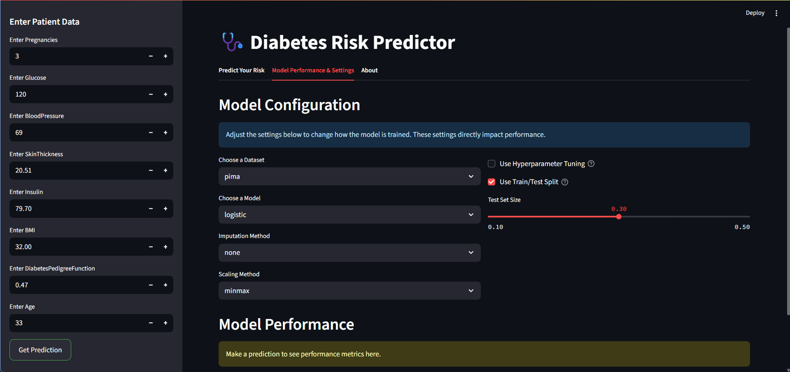

# Diabetes Risk Predictor: Machine Learning-Based Early Diagnosis

[](https://diabetes-ml-pipeline.streamlit.app/)



## Overview

This project implements a robust, research-backed machine learning pipeline and interactive web app for early diabetes risk prediction. It is based on the methodology and findings of our research paper:

**“Diabetes Diagnosis Using Machine Learning: High-Accuracy Predictive Modeling with Diverse Data Sources and Methods”**  
_Jasmin Patel, Pratham Patel, May Patel, Shankar Paramar_  
(See [`Diabetes_Diagnosis_using_Machine_Learning.pdf`](Diabetes_Diagnosis_using_Machine_Learning.pdf) for the full paper.)

---

## Research Motivation

Diabetes is a growing global health crisis, with hundreds of millions affected worldwide. Early and accurate detection is crucial for effective intervention and management. Traditional diagnostic methods, while essential, can be reactive and may miss early risk patterns.

Our research leverages machine learning (ML) to:

- Explore the impact of different data imputation, scaling, and modeling strategies on diabetes prediction.
- Compare results across two real-world datasets: the Pima Indians Diabetes Database (PIDD) and a Frankfurt hospital dataset.
- Identify optimal combinations of preprocessing and ML models for the highest predictive accuracy.

**Key findings:**

- KNN and SVM models achieved the highest accuracy (up to 0.97 and 0.91).
- The choice of imputation and preprocessing methods significantly affects model performance.
- The approach is validated in our published manuscript (see PDF).

---

## Features

- **Interactive Streamlit Web App**: User-friendly interface for risk prediction and experimentation.
- **Multiple Datasets**: Built-in support for Pima and Frankfurt datasets, or upload your own.
- **Flexible Preprocessing**: Choose from several imputation and scaling methods.
- **Model Selection**: Logistic Regression, SVM, KNN, Decision Tree, Random Forest.
- **Hyperparameter Tuning**: Optional grid search for best model parameters.
- **Evaluation Metrics**: Accuracy, precision, recall, F1-score, confusion matrix, ROC curve.
- **Research Transparency**: Full code and manuscript included.

---

## Quick Start

### 1. Clone the Repository

```bash
git clone https://github.com/Jasmin-Patel-2110/diabetes-ml-pipeline.git
cd diabetes-ml-pipeline
```

### 2. Install Dependencies

```bash
pip install -r requirements.txt
```

_(or use `uv pip install -r requirements.txt` if using uv)_

### 3. Run the App

```bash
streamlit run main.py
```

### 4. Try the Live Demo

[Live Streamlit App](https://diabetes-ml-pipeline.streamlit.app/)

---

## Project Structure

```sh
.
├── main.py                                         # Streamlit app entry point
├── pipeline/                                       # Modular ML pipeline (data, preprocess, models)
├── data/                                           # Datasets (Pima, Frankfurt)
├── assets/                                         # Contains app screenshot
├── requirements.txt                                # All dependencies
├── Diabetes_Diagnosis_using_Machine_Learning.pdf   # Full research paper
├── final_code.ipynb                                # Research notebook (experiments, results)
├── LICENSE                                         # MIT License
└── README.md                                       # This file
```

---

## How to Use

1. **Select a dataset** (Pima, Frankfurt, or upload your own CSV).
2. **Choose imputation and scaling methods** for preprocessing.
3. **Select a machine learning model** and optionally enable hyperparameter tuning.
4. **Enter patient feature values** in the form.
5. **Click “Prediction”** to see the risk class and probability.
6. **(Optional)** Enable train/test split to see real-world evaluation metrics and visualizations.

---

## Research Paper

The full methodology, experiments, and results are detailed in [`Diabetes_Diagnosis_using_Machine_Learning.pdf`](Diabetes_Diagnosis_using_Machine_Learning.pdf).  
Please cite our work if you use this project in your research.

---

## Authors

- Jasmin Patel
- Pratham Patel
- May Patel
- Prof. Dr. Shankar Paramar

Department of Computer Engineering, Government Engineering College, Bharuch, India

---

## License

This project is licensed under the MIT License. See [LICENSE](LICENSE) for details.

---

## Acknowledgements

- International Diabetes Federation (IDF)
- Pima Indians Diabetes Database (PIDD)
- Frankfurt Hospital Dataset

---

**For questions, issues, or contributions, please open an issue or contact the authors.**
